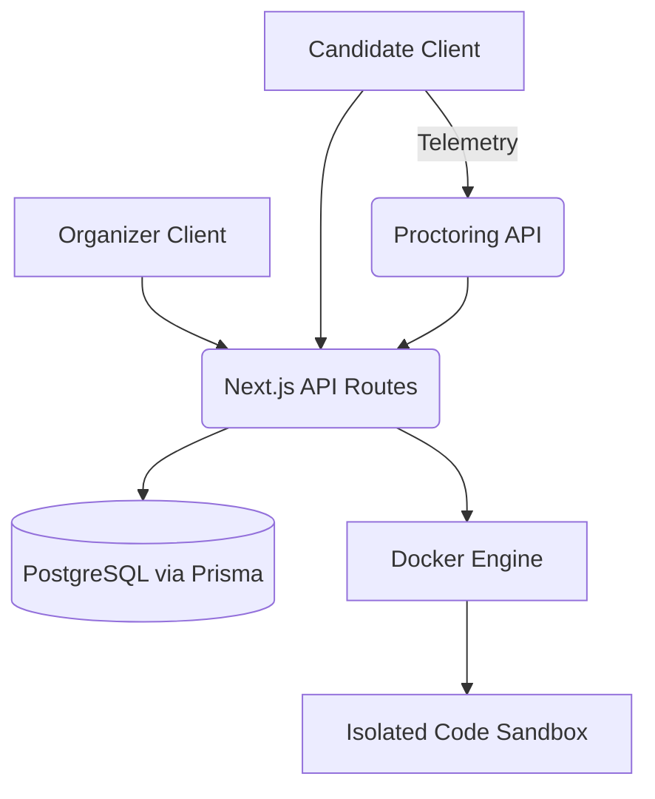

# SentinelX

**A secure, proctored assessment and coding evaluation platform.**

## Project Status

**Current Milestone:** Core Platform MVP & Assessment Ownership
Status: Active Development (Pre-production)

## Problem Statement

Conducting online technical assessments often involves cobbling together disparate tools for exam authoring, coding execution, and proctoring. This leads to disjointed user experiences, poor security boundaries, and high operational overhead.

## Proposed Solution

SentinelX provides a unified, deeply integrated platform where organizers can author question banks, build assessments, and securely deliver them to candidates. It combines a built-in Docker-based coding execution environment with a robust client-side proctoring engine.

## Core Features

- **Organizer Dashboard & Reports:** Secure management of assessments, question banks, and candidate attempts.
- **Assessment Builder:** Create exams with mixed formats (MCQ and Coding).
- **Candidate Exam Engine:** A locked-down browser experience with autosaving, server-authoritative timers, and offline resilience.
- **Proctoring Engine (Basic):** Tracks client-side telemetry (tab switches, window blurs, fullscreen exits, network drops, camera/mic availability).
- **Secure Coding Execution:** Safely evaluates candidate code against hidden test cases using an isolated, ephemeral Docker container sandbox.

## Architecture Overview



## Technology Stack

- **Framework:** Next.js (App Router)
- **Database:** PostgreSQL (via Prisma ORM)
- **Authentication:** Auth.js (NextAuth) for organizers, custom JWT for candidates
- **Code Execution:** Docker Engine
- **Styling:** TailwindCSS
- **Language:** TypeScript

## Main Workflows

- **Organizer Workflow:** Sign in -> Build Question Bank -> Create Assessment -> Distribute Join Link -> Review Reports.
- **Candidate Workflow:** Enter Access Code -> Verify Identity/Hardware -> Attempt Assessment (with live proctoring) -> Submit.

## Security Highlights

- **Organizer Ownership Boundaries:** Strict database-level isolation of all assessment and attempt data via server-derived `session.user.id`.
- **Candidate JWT:** Stateless, scoped JWTs tie candidate attempts to a specific assessment, preventing unauthorized access.
- **IDOR Prevention:** All API operations enforce ownership directly in the Prisma `where` clause.
- **Execution Sandbox:** Candidate code runs in `--network none`, severely restricted Docker containers (CPU/memory limits, read-only filesystem, dropped capabilities).

## Proctoring Capabilities Currently Implemented

- Tab Switch Detection
- Window Blur Detection
- Fullscreen Exit Tracking
- Network Connection Monitoring
- Camera & Microphone Availability Lifecycle
- Proctoring Incident Engine (5-minute sliding incident episodes, IncidentEvent traceability, incident severity, and attempt riskScore)
*(Note: Advanced AI/CV proctoring, face recognition, real-time WebSocket command center, and Redis background workers are slated for future phases).*

## Coding Execution Architecture

Candidate submissions are routed to the `run` API, which spawns an isolated Docker container configured for the submitted language. It executes against hidden test cases, returning the `stdout`/`stderr` securely to the Next.js backend for grading.

## Project Structure

```
SentinelX/
├── apps/
│   └── web/               # Next.js Application
│       ├── app/           # App Router (Pages & APIs)
│       ├── prisma/        # Database Schema & Migrations
│       ├── src/           # Components & Libs
│       └── auth.ts        # NextAuth Configuration
├── docs/                  # Detailed Project Documentation
└── package.json           # Monorepo/Workspace Config
```

## Local Setup

1. **Clone the repository.**
2. **Install dependencies:** `pnpm install`
3. **Database Setup:** 
   - Start a local PostgreSQL instance.
   - Update `DATABASE_URL` in `apps/web/.env`.
   - Run `pnpm --filter web exec prisma migrate dev`.
4. **Environment Variables:**
   - Configure `AUTH_SECRET` and `CANDIDATE_AUTH_SECRET`.
5. **Start Dev Server:** `pnpm --filter web dev`

## Deployment Overview

SentinelX is designed to be deployed to modern serverless or containerized environments (e.g., Vercel, Railway, Render). Note that the internal Docker execution engine requires a host capable of running Docker daemons (which may necessitate a dedicated execution service in production).

## Current Limitations

- Advanced behavioral analysis, AI/CV proctoring, and face recognition are not yet implemented.
- Real-time WebSocket/SSE command center and Redis/background proctoring workers are not yet present.
- Screenshot/evidence capture is not yet implemented.
- The Docker execution relies on the host daemon, which is challenging on serverless platforms (production-grade dedicated coding execution service is planned).

## Future Roadmap

See [`docs/DEVELOPMENT_ROADMAP.md`](./docs/DEVELOPMENT_ROADMAP.md) for full details on the planned path to Production, including AI/CV proctoring, advanced behavioral analysis, and a dedicated Coding Execution Service.