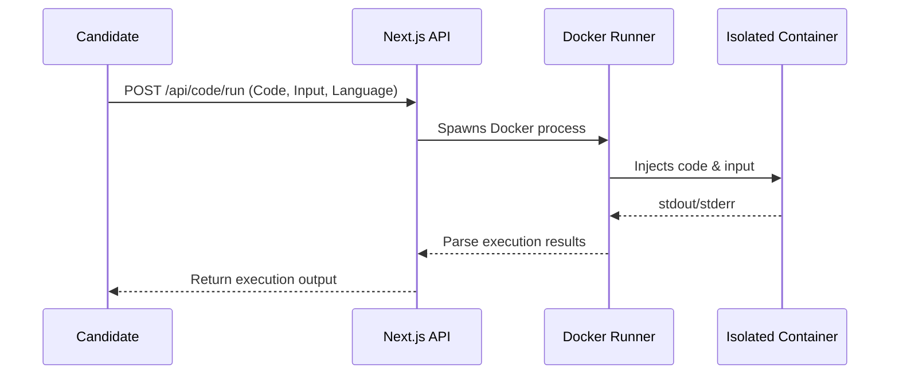

# SentinelX Coding Execution Architecture

This document describes the actual, currently implemented coding execution system within SentinelX.

## 1. Flow Overview

## 2. Execution Phases

### A. Manual Candidate Execution ("Run Code")
During the exam, a candidate can test their code.
1. The client sends the raw code and input to `POST /api/code/run`.
2. The server verifies the candidate JWT.
3. The server passes the payload to the internal Docker executor.
4. The output (`stdout`, `stderr`) is returned to the client to assist with debugging.

### B. Final Submission Evaluation
When the candidate officially submits a coding answer:
1. The server pulls the `CodingTestCase` records for the specific question. Test cases with `isHidden=true` are strictly kept server-side.
2. The server executes the candidate's code iteratively against each test case input.
3. The server's Judge logic compares the container's `stdout` strictly against the `expectedOutput`.
4. Marks are awarded incrementally for each passed test case.
5. The final aggregate score is saved to the `Answer` record.

## 3. Docker Sandbox Constraints

To safely execute untrusted candidate code, SentinelX spawns ephemeral Docker containers with extreme restrictions. 

Current actual constraints enforced during `docker run`:

- `--network none`: The container has no network interfaces (except loopback), completely preventing internet access, data exfiltration, or lateral movement.
- `--memory="128m"`: Hard cap on RAM to prevent memory exhaustion/OOM attacks on the host.
- `--cpus="0.5"`: Limits CPU allocation to prevent CPU starvation.
- `--pids-limit 64`: Restricts the number of child processes, mitigating fork bomb attacks.
- `--read-only`: The container's root filesystem is mounted as read-only.
- `--cap-drop ALL`: Removes all Linux capabilities (e.g., `CAP_NET_RAW`, `CAP_SYS_ADMIN`).
- `--security-opt no-new-privileges`: Prevents processes from gaining new privileges via `setuid`/`setgid`.
- **Timeouts:** The Node.js `exec` wrapper enforces a strict timeout (e.g., 5 seconds). If the container exceeds this, it is forcefully killed via `docker rm -f`.
- **Output Capping:** `stdout` and `stderr` buffers are truncated if they exceed predefined limits to prevent memory overflow on the Next.js backend.

## 4. Production Limitations

**Important Deployment Note:**

The current MVP implementation relies on executing raw `docker run` commands directly from the Next.js backend. This architecture expects that the web application host possesses a running Docker daemon (and sufficient privileges to use it).

While this functions perfectly in local environments or traditional VM deployments, modern Serverless platforms (like Vercel, AWS Lambda) and restricted PaaS environments (like Railway) do not typically permit nested Docker execution. 

To deploy the coding execution capabilities of SentinelX to production securely, the execution logic must eventually be decoupled into a dedicated, scalable execution service (e.g., a gRPC/HTTP service running on a dedicated Kubernetes cluster or compute instance).
