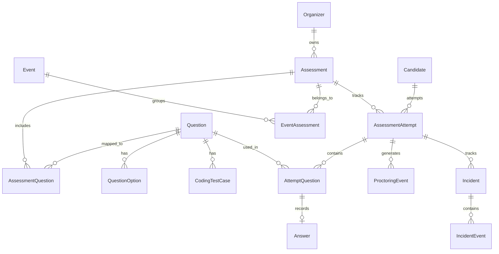

# SentinelX Database Documentation

SentinelX uses PostgreSQL via Prisma. This document describes the currently implemented schema, relationships, and model purposes.

## Entity Relationship Diagram

## Core Models

### Organizer
- **Purpose**: Represents an authenticated administrator/faculty who authors exams.
- **Key Fields**: `email`, `passwordHash`.
- **Relationships**: Owns multiple `Assessment` records.

### Assessment
- **Purpose**: Defines an exam's structure, rules, and configuration.
- **Key Fields**: `title`, `duration`, `passingScore`, `securityLevel`, `accessCode`.
- **Relationships**: 
  - Belongs to an `Organizer` (enforces data isolation).
  - Contains many `AssessmentQuestion`.
  - Links to many `AssessmentAttempt`.
- **Indexes**: `@@index([organizerId])`.

### Question
- **Purpose**: Global, reusable template for an exam question.
- **Key Fields**: `type` (`MCQ` or `CODING`), `difficulty`, `defaultMarks`, `starterCode`.
- **Relationships**:
  - `options`: Links to `QuestionOption` (if MCQ).
  - `testCases`: Links to `CodingTestCase` (if CODING).
  - Used in many `AssessmentQuestion`.

### QuestionOption
- **Purpose**: Stores MCQ choices.
- **Key Fields**: `text`, `isCorrect`.
- **Constraints**: Deletes cascade if `Question` is deleted.

### CodingTestCase
- **Purpose**: Defines input/expected output for code evaluation.
- **Key Fields**: `input`, `expectedOutput`, `isHidden`, `marks`.
- **Security**: Handled securely on the backend; never exposed to candidates during an active exam.

### AssessmentQuestion
- **Purpose**: A join table mapping a `Question` to an `Assessment`.
- **Key Fields**: `marks`, `order`.
- **Constraints**: `@@unique([assessmentId, questionId])`.

---

## Candidate & Exam Attempt Models

### Candidate
- **Purpose**: Represents the end-user taking the exam.
- **Key Fields**: `email`, `name`, `phone`.
- **Relationships**: Has many `AssessmentAttempt`.

### AssessmentAttempt
- **Purpose**: Represents a specific candidate's session for an assessment.
- **Key Fields**: `status` (enum: `NOT_STARTED`, `IN_PROGRESS`, `SUBMITTED`, etc.), `score`, `riskScore`.
- **Relationships**: 
  - Links `Candidate` and `Assessment`.
  - Parent to `AttemptQuestion`, `ProctoringEvent`, and `Incident`.
- **Indexes**: heavily indexed on `candidateId` and `[assessmentId, status]` for dashboard queries.

### AttemptQuestion
- **Purpose**: Snapshots the questions assigned to a specific attempt.
- **Key Fields**: `order`, `marks`, `visited`, `answered`.
- **Relationships**: Links directly to a `Question` and an `Answer`.
- **Constraints**: Restrict deletion if the global `Question` is deleted to preserve exam integrity.

### Answer
- **Purpose**: Stores the candidate's actual submission for a specific question.
- **Key Fields**: `selectedOptionId` (for MCQs) or `submittedCode`/`language` (for Coding). `isCorrect`, `score`.
- **Lifecycle**: Periodically updated (upserted) via autosave logic during the exam.

---

## Proctoring Models

### ProctoringEvent
- **Purpose**: Stores raw telemetry logs from the candidate's client.
- **Key Fields**: `eventType` (`ProctoringEventType` enum), `timestamp`, `clientTimestamp`, `metadata`.
- **Relationships**: Belongs to an `AssessmentAttempt`.
- **Note**: Serves as the raw data source for the Incident Engine.

### Incident
- **Purpose**: Groups suspicious telemetry into 5-minute sliding episodes.
- **Key Fields**: `type` (enum), `severity` (enum), `status` (enum).
- **Relationships**: Belongs to `AssessmentAttempt`, has many `IncidentEvent`.

### IncidentEvent
- **Purpose**: Provides traceability linking an `Incident` to specific `ProctoringEvent`s.
- **Key Fields**: `incidentId`, `proctoringEventId`.
- **Relationships**: Joins `Incident` and `ProctoringEvent`.

---

## Organization Models

### Event
- **Purpose**: A logical grouping of multiple assessments (e.g., "Fall 2026 Hiring Drive").
- **Key Fields**: `title`, `startDate`, `endDate`.
- **Relationships**: Links to `EventAssessment`.

### EventAssessment
- **Purpose**: Join table mapping `Event` to `Assessment`.
