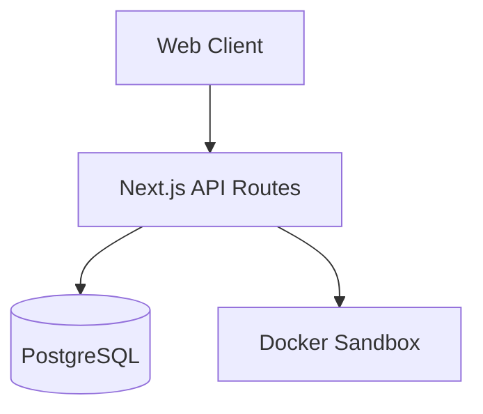
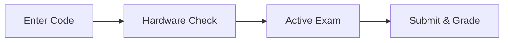

# SentinelX Project Documentation

## 1. Introduction
SentinelX is a unified, secure platform for building, distributing, and conducting proctored technical assessments. It provides organizers with tools to curate question banks and assessments, while offering candidates a monitored environment with integrated coding execution capabilities.

## 2. Problem Statement
The current landscape of online technical hiring relies on disjointed tooling—using one platform for exam creation, a separate tool for proctoring, and a third for remote code execution. This fragmentation creates severe security vulnerabilities (e.g., IDORs, session leakage), poor user experience, and high integration overhead.

## 3. Existing System
Historically, organizations stitched together generic forms (for MCQs), standalone compilers, and external proctoring software. These setups often lacked strict data isolation boundaries and failed to securely evaluate code against hidden constraints in a controlled environment.

## 4. Proposed System
SentinelX proposes a tightly integrated monolithic application architecture that natively combines an Assessment Engine, a basic Proctoring Engine, and a Docker-based Code Execution Sandbox. Organizers manage their private datasets securely, while candidates experience a seamless, secure exam flow.

## 5. Objectives
- **Security:** Ensure strict data isolation (Organizer boundaries, stateless Candidate access).
- **Integrity:** Monitor exam conditions through client-side telemetry.
- **Evaluation:** Provide safe, reliable remote code execution.
- **Reliability:** Support autosaving and offline resilience during exams.

## 6. Scope
The current MVP covers Organizer authentication, question/assessment building, candidate attempt flows, real-time proctoring telemetry tracking, a Proctoring Incident Engine with Risk Scoring, and automated MCQ/coding evaluation. Features like AI/CV proctoring, face recognition, realtime WebSocket alerting, and screenshot/evidence capture are out of scope for the current milestone.

## 7. Functional Requirements
- Organizers must be able to authenticate and manage their private assessments and results.
- Candidates must join via an access code and secure their session.
- The platform must capture telemetry events (tab switches, camera state, etc.).
- The platform must evaluate code against hidden test cases.
- The platform must generate analytics and reports based on attempts.

## 8. Non-Functional Requirements
- **Isolation:** Execution of arbitrary code must not compromise the host system.
- **Performance:** Submissions and telemetry must be processed efficiently without blocking the exam UI.
- **Security:** API endpoints must enforce strict authorization boundaries.

## 9. User Roles
- **Organizer:** Creates questions, builds assessments, views reports. Owns and manages all assessment data.
- **Candidate:** Attempts the assessment under monitored conditions via a stateless JWT session.

## 10. System Architecture

## 11. Application Architecture
SentinelX is built as a Next.js App Router application. It uses Server Actions and API routes for backend logic, Prisma for database access, and TailwindCSS for styling. State management relies on React context and SWR for data fetching.

## 12. Database Architecture
The application uses PostgreSQL. Key entities revolve around the `Assessment` model, which links to `Organizer`, `Question`, and `AssessmentAttempt`. The `AssessmentAttempt` acts as the root for `Answer`, `ProctoringEvent`, and `Incident` records. 
*(See DATABASE.md for details).*

## 13. Authentication Architecture
- **Organizers:** Authenticate via Auth.js (NextAuth) using a Credentials provider (bcrypt password hashing). Sessions are stored via HTTP-only cookies.
- **Candidates:** Authenticate via a custom, stateless JWT generated upon joining an exam. This JWT is scoped to the specific `attemptId` and `assessmentId`.

## 14. Organizer Workflow
1. Authenticate via `/login`.
2. Manage Questions via the Question Bank.
3. Construct an Assessment.
4. Distribute the Join Link.
5. Monitor results and view reports via the Dashboard.

## 15. Candidate Workflow

## 16. Assessment Management
Assessments define the exam structure (duration, passing score, security level). Organizers selectively add questions and define the grading weight (`marks`) and sequence (`order`) for each.

## 17. Question Bank
Questions are global templates that can be reused across multiple assessments. They include types (MCQ, CODING) and related entities like `QuestionOption` and `CodingTestCase`.

## 18. Answer Persistence
During an exam, the client autosaves answers (selected options or raw code) via throttled API calls to `/api/attempts/[id]/answers`. 

## 19. Evaluation System
- **MCQ:** Evaluated instantly upon submission by comparing the selected option against the stored `isCorrect` flag.
- **Coding:** Evaluated securely by passing the submitted code to the Execution Engine.

## 20. Coding Execution System
Uses a built-in Docker engine to run isolated containers. The backend spawns a Python runner, injects the code and hidden test cases, executes them with strict memory/CPU limits, and parses the structured output to assign marks.

## 21. Proctoring System
Tracks browser and hardware states. The client aggregates events (e.g., `TAB_SWITCH`, `FULLSCREEN_EXIT`) and flushes them to the server in batches. The Incident Engine synchronously processes these events to generate Incidents and update attempt Risk Scores. 
*(See PROCTORING.md for details).*

## 22. Camera and Microphone Monitoring
The client explicitly requests media permissions during preflight and continuously monitors the tracks during the exam. If tracks are stopped or disconnected, the system logs `CAMERA_UNAVAILABLE` or `MICROPHONE_UNAVAILABLE` events.

## 23. Events
Assessments can be grouped into `Event` entities (e.g., "Campus Drive 2026"), allowing organizers to manage multiple assessments under a single logical grouping.

## 24. Candidates and Results
Candidate identities are captured during the join phase. The system links their identity to the `AssessmentAttempt`, which aggregates scores and statuses (`NOT_STARTED`, `IN_PROGRESS`, `SUBMITTED`).

## 25. Reports and Dashboard
The dashboard aggregates data (total attempts, average scores, recent activity) strictly scoped to the `organizerId`. Reports provide deeper insights into score distributions and completion rates.

## 26. System Health
A basic health check endpoint verifies database connectivity and general API availability.

## 27. Security Architecture
SentinelX relies on two distinct authorization boundaries (Organizer Session vs Candidate JWT). Code execution relies on Docker namespace isolation, and database queries rely on Prisma relational filtering.
*(See SECURITY.md for details).*

## 28. API Architecture
The API is heavily RESTful, built atop Next.js Route Handlers (`app/api/*`). It returns standard JSON responses and leverages Next.js middleware (`proxy.ts`) for basic route protection.
*(See API_DOCUMENTATION.md for details).*

## 29. Deployment Architecture
Designed for containerized environments. The web application requires access to a PostgreSQL database and a Docker daemon (via `/var/run/docker.sock`) for coding execution.

## 30. Testing and Validation
SentinelX currently relies on strict TypeScript compilation (`tsc --noEmit`), Prisma schema validation, and manual API regression testing for authorization flows.

## 31. Current Limitations
- Code execution is limited to Python.
- Execution occurs on the same host as the web server, which limits scalability in serverless environments. A dedicated coding execution service is needed for production.
- Proctoring is purely telemetry-based (no webcam recordings or screenshots are currently saved or analyzed).

## 32. Future Enhancements
- AI/CV proctoring, advanced behavioral analysis, and face recognition.
- Screenshot/evidence capture.
- Real-time WebSocket/SSE command center.
- Redis/background workers for asynchronous proctoring analysis.
- Production-grade dedicated scalable execution service.

## 33. Conclusion
SentinelX MVP provides a highly secure, functional foundation for conducting technical assessments. The architecture ensures strict data privacy and safe code execution, positioning the platform for advanced AI integrations in future phases.
